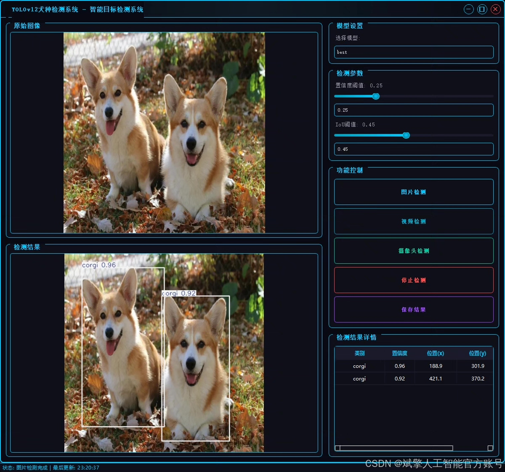
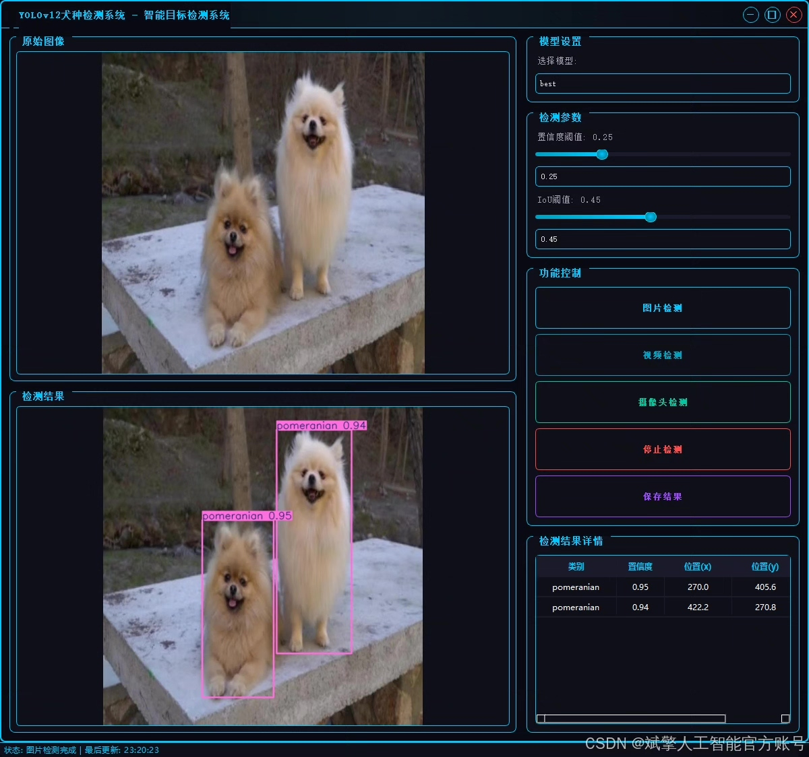
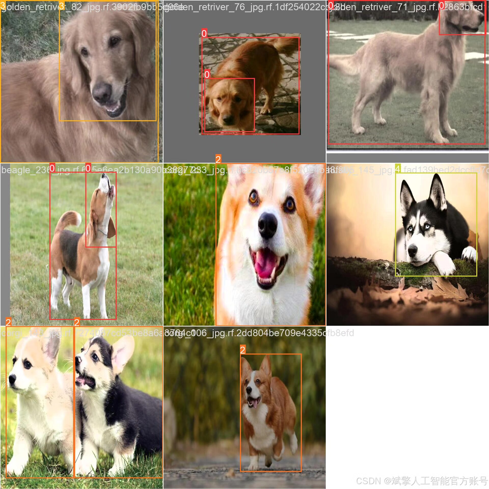
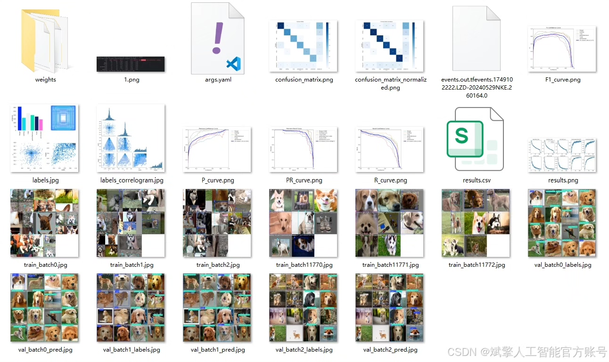
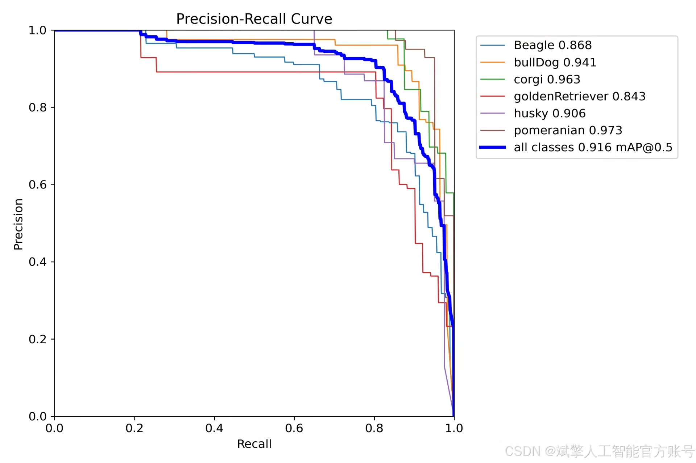
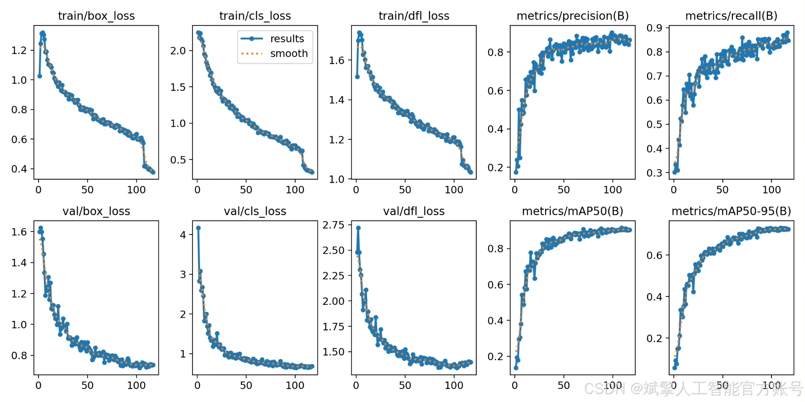
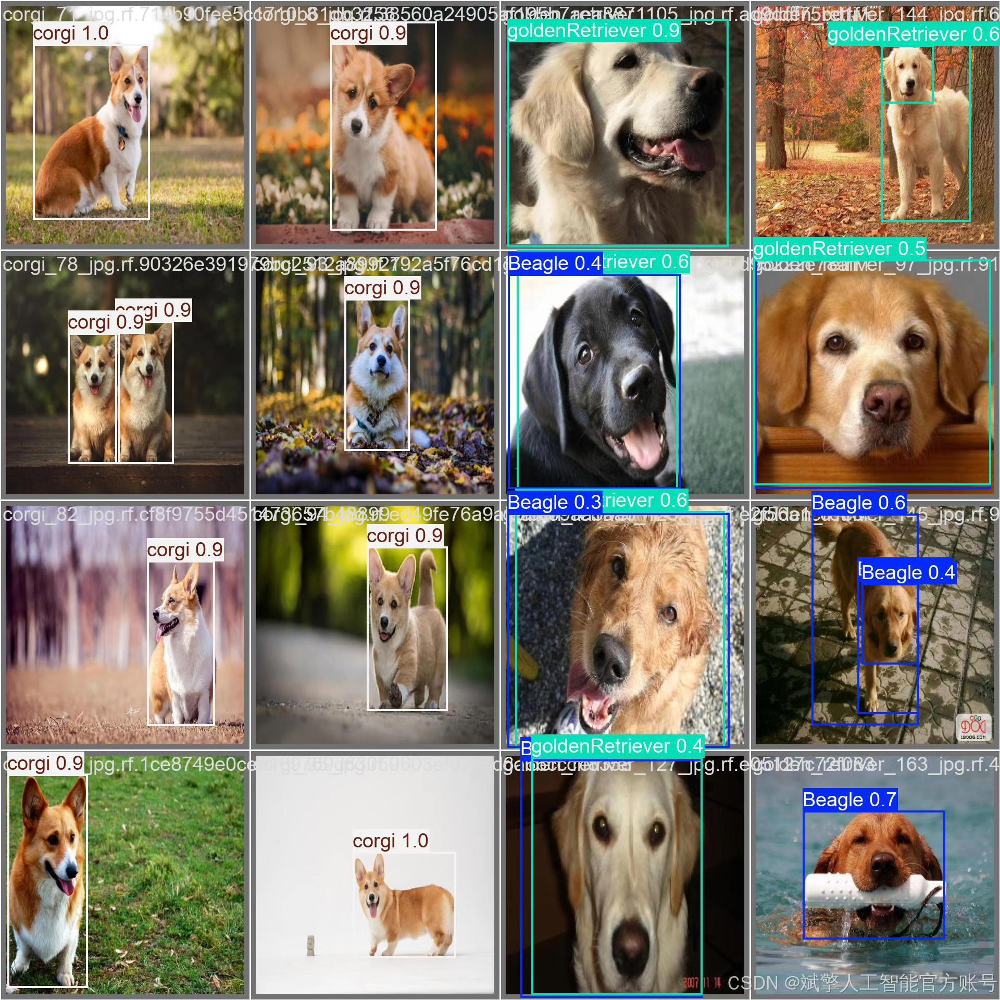
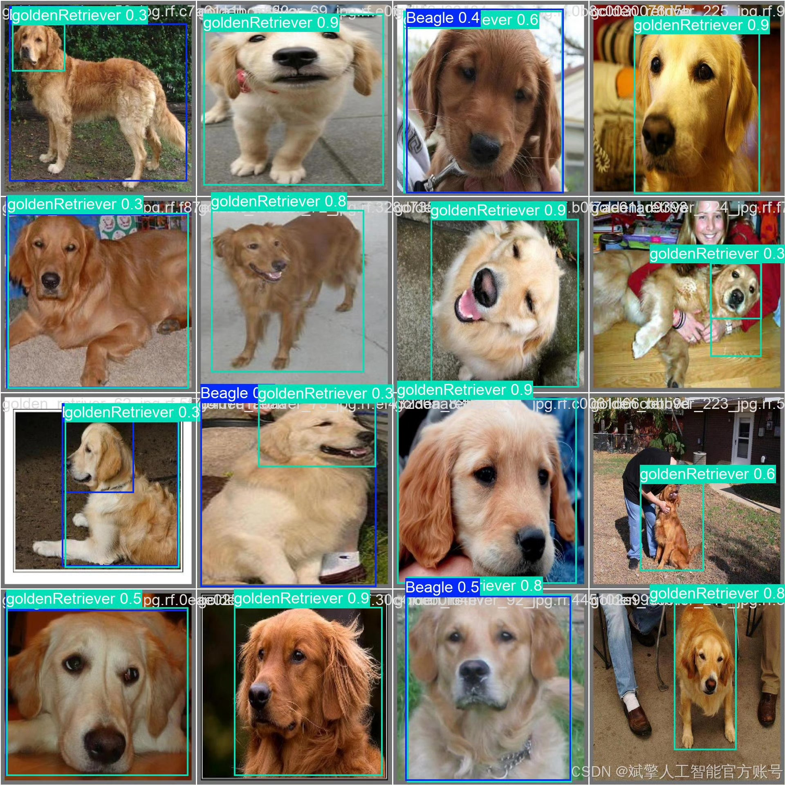

# YOLOv12 Dog Breed Identification System

## Body

YOLOv12 Dog Species Recognition System Based on Deep Learning YOLOv12 (YOLOv12+YOLO dataset + UI interface + login and registration interface + Python project source code + model)

The purpose of this project is to develop a dog species automatic recognition system based on the YOLOv12 object detection model. The system can detect dogs in images or videos in real-time, and accurately identify them as belonging to six specific dog breeds, including Beagle, Bulldog, Corgi, Golden Retriever, Husky, and Pomeranian. As the latest iteration of the YOLO series, YOLOv12 provides strong technical support for this system with its outstanding detection speed and accuracy, making it very suitable for practical applications such as pet management, intelligent security, dog lost finding, and automated image content annotation.

Dataset:
nc: 6
names: ['Beagle', 'bullDog', 'corgi', 'goldenRetriever', 'husky', 'pomeranian'],
dataset quantity: training set 880, validation set 251, test set 126

✅ User login and registration: Support password detection and security verification.
✅ Three detection modes: Based on the YOLOv12 model, support image, video, and real-time camera detection, precise target recognition.
✅ Dual-screen comparison: Display original scene and detection results on the same screen.
✅ Data visualization: Real-time table displaying the category, confidence, and coordinates of detected targets.
✅ Intelligent parameter adjustment: Offer a confidence slide bar, dynamically optimize detection accuracy to meet different scene needs.
✅ Sci-fi style interactive interface: Dark theme combined with dynamic light effects, reducing visual fatigue and improving operational experience.

## Images

## Payment

Here is a pay link on Stripe ( https://buy.stripe.com/3cs8yP7sY87d0vu9AB ). Please contact me lonlonago@foxmail.com after funding $89, and I will send you a complete data files , thank you!

